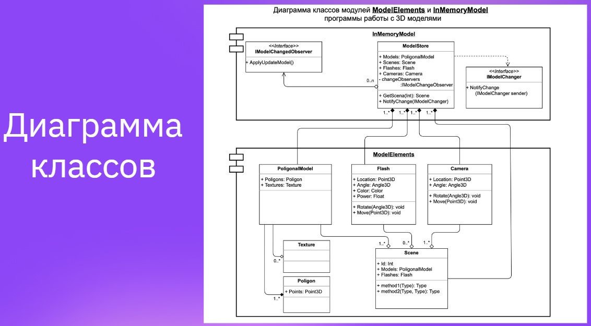

# Архитектура ПО 
### Домашнее задание 1. Введение в понятие архитектуры, проектирование ПО и жизненный цикл программного продукта. UML-диаграммы

**Задание 1**. На основе Диаграммы классов ModelElements, разработать классы: 
- Model Store, 
- PoligonalModel (Texture, Poligon), 
- Flash, 
- Camera, 
- Scene 

Реализовать диаграмму на любом языке программирования.

**Задание 2**. Ознакомиться с документацией в свободном формате, которая может пригодиться Вам для дальнейшей работы:

- ГОСТ Р ИСО/МЭК 12207-2010 Информационная технология (ИТ). Системная и программная инженерия. Процессы жизненного цикла программных средств.
- ISO/IEC/IEEE 29148:2018 Systems and software engineering — Life cycle processes — Requirements engineering
- Стандарты ЕСКД — единая система конструкторской документации
- ГОСТ 2.001-2013 ЕСКД. Общие положения
- Стандарты АСУ ГОСТ 34 — автоматизированные системы управления
- Стандарты ЕСПД ГОСТ 19 — единая система программной документации

Полное руководство по диаграмме классов UML:

https://www.cybermedian.com/ru/a-comprehensive-guide-to-uml-class-diagram/

Диаграмма для 'Задания 1' в презентации:

https://docs.google.com/presentation/d/1d-ReTu3A_944hmccTxqbUrRNMHtIDViiCMKvUUaKu24/edit?pli=1#slide=id.g161fe117232_1_7
